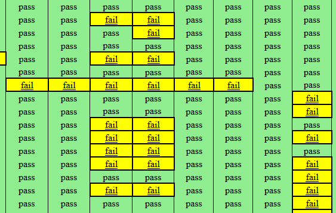
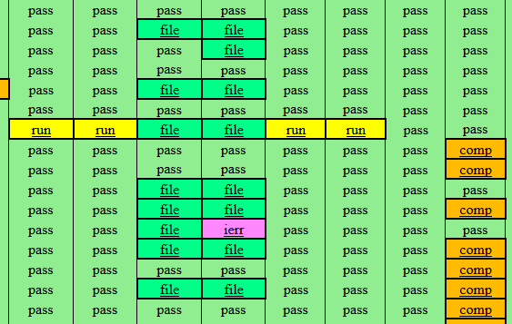

summary-enhancer
================

Program downloading Boost libraries regression summary pages and enhancing them for more convenient analysis.

================

The goal is to change this page of equally-displayed failures:

into meaningful list of specific errors to allow focusing on more important ones first:

Failures list:

 * comp - compilation error
 * link - linking error
 * run - run-time error
 * time - compilation time limit exceeded
 * file - compilation ended with "file too big" error
 * ierr - internal compiler error
 * unkn - unknown failure

================

Usage:

    program lib_name...
    
Example:

    program geometry geometry-index geometry-extensions
    
Pass space-separated list of libraries. In sublibs names use dash instead of slash, e.g. geometry-index.

================

To compile the code, the following libraries are required:

 * Boost (http://www.boost.org)
 * cpp-netlib (http://cpp-netlib.org)
 * rapid-xml (included in this repo)

================

The program does the following steps:

  1. download required CSS file
  2. create output "result" directory
  3. for all passed summary pages
    1. download summary page
    2. for each failed test
      1. download the log
      2. check the cause and modify test's entry
